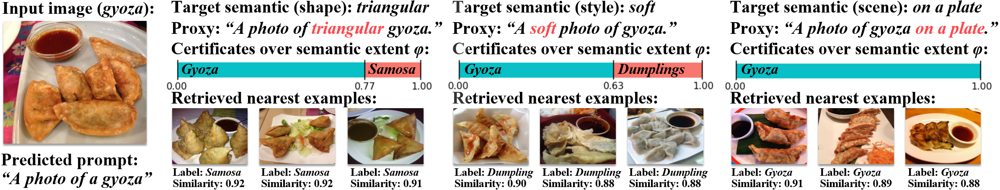

<h1 align="center">Semantic Robustness Certification for Vision-Language Models</h1>
<!-- <h2 align="center"><strong>ICML 2026</strong></h2> -->

This code implements the semantic robustness certification framework from the following paper:

> Peiyu Yang, Paul Montague, Feng Liu, Andrew C. Cullen, Amardeep Kaur, Christopher Leckie, and Sarah M. Erfani
>
> [Semantic Robustness Certification for Vision-Language Models](https://example.com)

This repository provides tools for certifying whether a VLM prediction remains invariant under language-specified semantic transformations such as shape, style, size, material, illumination, viewpoint, or background changes. The core idea is to use text prompts as semantic proxies, construct a semantic transformation in the shared image-text embedding space, and analytically certify prediction-invariant intervals along the semantic extent.

The source code will be released after the completion of the required approval process.

## Overview


Vision-language models align image and text embeddings in a shared unit sphere. This makes it possible to define semantic variations using prompt pairs, for example:

```text
a photo of a gyoza
a photo of a triangular gyoza
```

For an image embedding, the method constructs a semantic transformation from the source text embedding to the target semantic embedding. It then characterizes VLM decision boundaries in closed form and returns intervals over the semantic extent where the predicted class is provably unchanged.

The included demo certifies a Food101 image of `gyoza` under three semantic attributes:

```text
shape: triangular
style: soft
background: on a plate
```

It also reports a semantic misalignment bound at a user-specified budget.


## Citation

If you use this code, please cite:

```bibtex
@inproceedings{yang2026semanticcert,
  title     = {Semantic Robustness Certification for Vision-Language Models},
  author    = {Yang, Peiyu and Montague, Paul and Liu, Feng and Cullen, Andrew C. and Kaur, Amardeep and Leckie, Christopher and Erfani, Sarah M.},
  booktitle = {Proceedings of the 43rd International Conference on Machine Learning},
  year      = {2026}
}
```

## Acknowledgements

This codebase builds on Dassl.pytorch and CLIP-style prompt-learning infrastructure. We thank the authors of the underlying open-source projects for making their implementations available.
